# USB Maus Bausatz

Aktuell verschicken wir 3-Tastige-Bausätze.

**Inhaltsverzeichnis**
- [Übersicht der Einzelteile](#übersicht-der-einzelteile)
- [Benötigte Werkzeuge](#benötigte-werkzeuge)
- [Platine bestücken](#platine-bestücken)
- [Finaler Zusammenbau](#finaler-zusammenbau)

## Übersicht der Einzelteile

  

Bodenplatte  

Oberaschale  

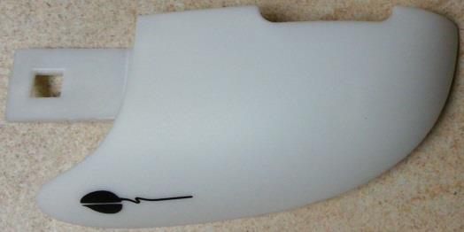
Rechte Taste  

Linke Taste  

Hölzernes Mausrad  

Optik (Linse)  

USB Kabel  

Torx (Vielzahn) Schraube (2 x T9 und 2 x T10)  

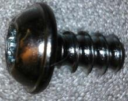
2 x für Maustasten  

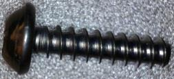
2 x für Gehäuse  

2 x Kondensatoren 0,1µF  

Kondensator 10µF  

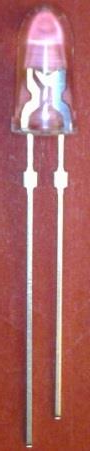
LED Grün / Rot  

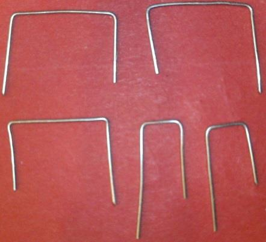
5 x Drahtbrücken, da Platine einseitig  

2 x Schalter für Linke und Rechte Taste  

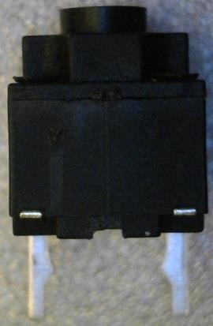
Schalter für Mitteltaste  

Drehgeber für Mausrad  

Herzstück der Maus: Optischer Sensor, Prozessor und USB Schnittstelle  

Gleitplättchen  

Platine (Vorder- und Rückseite mit Erklärung)

## Benötigte Werkzeuge

Elektronik (fein) Seitenschneider  

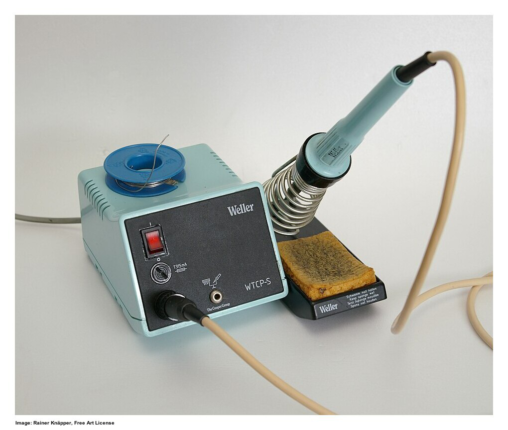
Lötstation  

Torx T9 Bit  

Torx T10 Bit  

Bleifreies Lötzinn

## Platine bestücken

Beim Bestücken der Platine gibt es ein Reihenfolge welche einzuhalten äußerst ratsam ist.
Die Bauteile werden immer von flach (z.B. Drahtbrücken, Widerstände, ....) nach hoch (z.B. Schalter, Kondensatoren, ....) sortiert.
Als vorletztes werden Anschluss Leitungen verlötet, da diese ansonsten während dem Bestücken und Löten stören können .
Der Optische Maussensor/Prozessor wird ganz zum Schluss bestückt.
> :warning: Immer erst ein Bein eines Bauteiles verlöten und dann den korrekten Sitz kontrollieren (z.B. liegen die Bauteile, Drähte sauber auf der Platine auf).  

### Schlechtes Beispiel

### Drahtbrücken bestücken

### Kondensatoren und LED bestücken

### Taster bestücken

### Elko bestücken

### Drehgeber bestücken

### USB Kabel
1. Die Kabelisolation ca 25mm vom Ende her (Hülle)mit einem nicht zu scharfen Messer vorsichtig einkerben. 
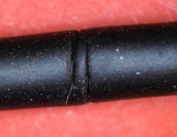 
2. Die Kabelisolation (Hülle) vorsichtig mit (dem Daumennagel) abziehen. 
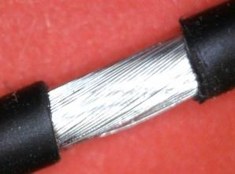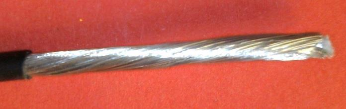 
3. Die Drahtschirmung vorsichtig abwickeln (man kann sich an den feinen Drähten stechen) 
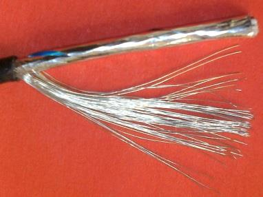 
4. Drahtschirm verdrillen und den Folienschirm abwickeln 
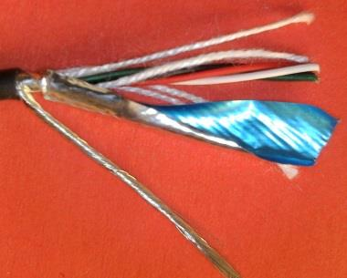 
5. Die Füllfäden mit einem Messer oder Seitenschneider abschneiden 
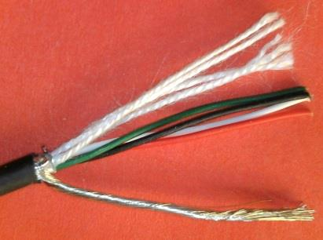 
6. Das Ende des verdrillten Schirmgeflechtes verzinnen 
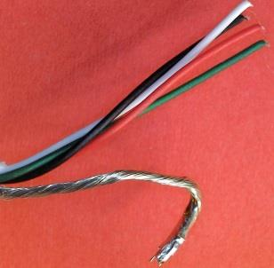 
7. Die Isolation der Farbigen Adern an den Enden vorsichtig maximal 3mm entfernen 
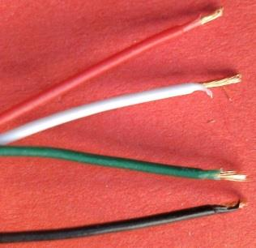 
8. Die Adern Enden verzinnen. Die Isolation zieht sich durch die Hitze noch weiter zurück 
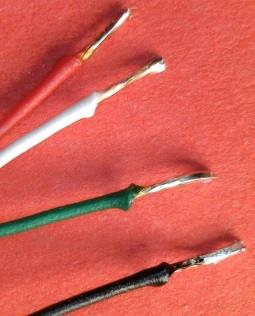 
9. Nun kann das USB Kabel in die Platine eingelötet werden

 

Eine gute Lötstelle zeichnet sich durch eine glänzende Oberfläche aus (mit Bleihaltigem Lötzinn). Bleifreies Lötzinn ergibt immer eine matte Oberfläche. 

### Sensor bestücken
 
> :warning: Um Schäden des Sensors durch elektrische Ladungen zu verhindern, sollte man sich vor dem Berühren des Sensors selbst entladen haben, z.B. an der Erdung der Steckdose oder dem Metall eines Heizkörpers.

## Unterschale bearbeiten für dritte Taste
In der rechten Aufhängung des Scrollrad muss unten das hochstehende Mittelteil weggebrochen werden, damit das Drücken der dritten Taste funktioniert.
 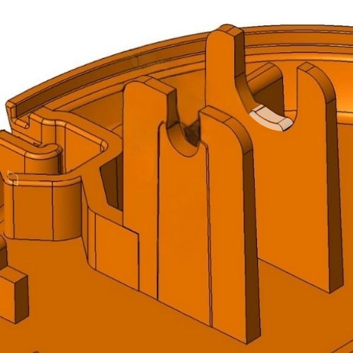

## Finaler Zusammenbau

  
  
    
Wenn alles richtig gemacht wurde und keine Kurzschlüsse gelötet wurden, kann die korrekte Funktion der Maus am PC getestet werden. Nun haben wir eine 3 Tasten USB Maus welche einmalig auf der Welt ist, da sie selbst zusammengebaut wurde.